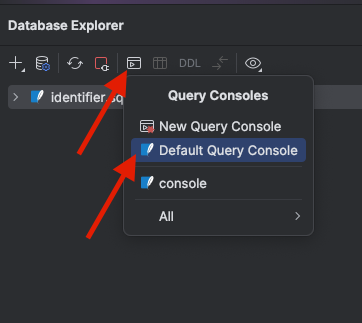

#Quick intro to DataGrip/SQL

1. [Download a copy of DataGrip](https://www.jetbrains.com/datagrip/download/) for your computer, and install it.
2. From DataGrip's File menu, select New, then Project.
3. Give the project a name, such as "ClassDatabase." 
4. From the File menu, select New, then Data Source, then SQLite.
5. In the window that appears, click "OK."
6. In the upper-left corner, in the Database Explorer, click the icon for "Query Consoles" (as shown in the image below), then on "Default Query Console."

7. In the text box that appears, copy and paste each of the code boxes below, then click the Execute button (the green arrow). We'll discuss what each of these does in class.

### Create the courses table
```
-- Create the courses table
CREATE TABLE courses (
    CourseID INTEGER PRIMARY KEY AUTOINCREMENT,
    CourseNumber TEXT,
    CourseDescription TEXT
);
```
### Create the students table
```
-- Create the students table
CREATE TABLE students (
    StudentID INTEGER PRIMARY KEY AUTOINCREMENT,
    StudentFirstName TEXT,
    StudentLastName TEXT
);
```
### Create the enrollments table
```
-- Create the enrollments table
CREATE TABLE enrollments (
    EnrollmentID INTEGER PRIMARY KEY AUTOINCREMENT,
    CourseID INTEGER,
    StudentID INTEGER,
    FOREIGN KEY (CourseID) REFERENCES courses(CourseID),
    FOREIGN KEY (StudentID) REFERENCES students(StudentID)
);
```
### Insert sample courses
```
-- Insert sample courses
INSERT INTO courses (CourseNumber, CourseDescription) VALUES
('IST 110', 'Information, People, and Technology'),
('CAS 100B', 'Group Public Speaking'),
('MATH 140', 'Calculus With Analytic Geometry I');
```
### Insert sample students
```
-- Insert sample students
INSERT INTO students (StudentFirstName, StudentLastName) VALUES
('John', 'Doe'),
('Jane', 'Smith'),
('Michael', 'Johnson'),
('Emily', 'Brown'),
('David', 'Williams'),
('Sarah', 'Jones'),
('Christopher', 'Davis'),
('Jessica', 'Miller'),
('Matthew', 'Wilson'),
('Ashley', 'Moore');
```
### Enroll students in classes
```
-- Enroll students in classes
INSERT INTO enrollments (StudentID, CourseID)
VALUES
    (1, 1), (1, 2), (1, 3),
    (2, 1), (2, 2), (2, 3),
    (3, 1), (3, 2), (3, 3),
    (4, 1), (4, 2), (4, 3),
    (5, 1), (5, 2), (5, 3),
    (6, 1), (6, 2),
    (7, 1), (7, 2),
    (8, 1), (8, 2),
    (9, 1), (9, 2),
    (10, 3);
```
### Get list of all student names, course numbers, and course descriptions for each enrollment
```
-- Get list of all student names, course numbers, and course descriptions for each enrollment
SELECT
    s.StudentFirstName,
    s.StudentLastName,
    c.CourseNumber,
    c.CourseDescription
FROM
    students s
INNER JOIN
    enrollments e ON s.StudentID = e.StudentID
INNER JOIN
    courses c ON e.CourseID = c.CourseID
ORDER BY StudentLastName ASC
```